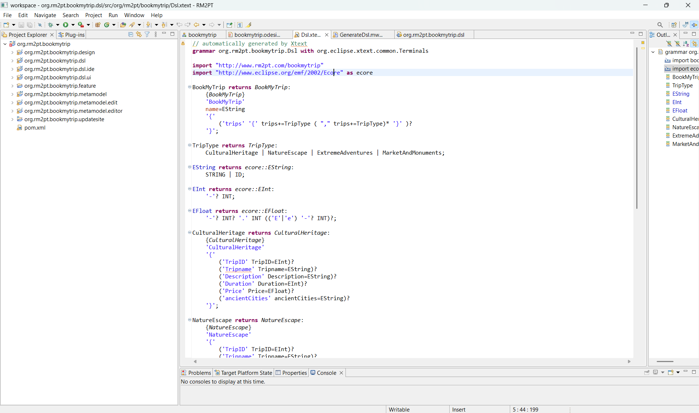

# 📦 BookMyTrip DSM

> A Domain-Specific Modeling (DSM) project for defining and managing travel bookings using **RM2PT + Sirius**.  
> This repository contains:  
> - **An Ecore Metamodel** for the BookMyTrip domain  
> - **A Textual DSL** to author trip instances  
> - **A Sirius-generated graphical editor** to visualize and edit models
> - **Eclipse Xtext text language modeling** to automatically generate the corresponding Xtext
 grammar from the EMF metamodel.  
> - **Maven setup** to build & package as an Eclipse plugin  

---

## 📑 Table of Contents

1. [Ecore Metamodel Overview](#1-ecore-metamodel-overview)  
2. [Sirius Design (Graphical Viewpoint)](#2-sirius-design-graphical-viewpoint)  
3. [Sirius Graphical Editor View](#3-sirius-graphical-editor-view)
4. [Xtext Textual Language Modeling](#4-xtext-textual-language-modeling)  
5. [Plugin Testing (Sirius Graphical Viewpoint)](#5-plugin-testing-sirius-graphical-viewpoint)  
6. [Conclusion & Next Steps](#6-conclusion--next-steps)  

---

## 1. Ecore Metamodel Overview

Below is the EMF class diagram that defines the core BookMyTrip metamodel. It shows the root `BookMyTrip` container and the various `TripType` subclasses:

> **Figure 1.** EMF class diagram for the BookMyTrip metamodel. The `BookMyTrip` root contains a collection of `TripType` instances, each with its own attributes and subtype.

  
*<!-- Insert Figure 1 here -->*

---

## 2. Sirius Design (Graphical Viewpoint)

The screenshot below shows the **Sirius Specification Editor**, illustrating how the BookMyTrip metamodel has been mapped into a graphical viewpoint (`bookmytrip.odesign`) within the `org.rm2pt.bookmytrip.design` plugin:

> **Figure 2.** The Sirius Specification Editor for BookMyTrip. Each trip-type node is represented (`CulturalHeritageNode`, `NatureEscapeNode`, `ExtremeAdventuresNode`, `MarketAndMonumentsNode`), and creation tools are defined under the “Section” node.

  
*<!-- Insert Figure 2 here -->*

### Key Elements

1. **BookMyTripDiagram**  
   - The root diagram element under which all node definitions live.

2. **Default Layer**  
   - Contains node styles for each `TripType` subclass (e.g., `CulturalHeritageNode`, `NatureEscapeNode`).  
   - Each node’s **Domain Class** is set (e.g., `bookmytrip::CulturalHeritage`), plus a **Semantic Candidates Expression** (`feature:members`) to display contained instances.  
   - A **Basic Shape** or **Workspace Image** style is chosen, with custom color and label expressions.

3. **Node Creation Tools**  
   - Under each “Node Creation X” section, there is a `Node Creation Variable` named `container` (pointing at the current `BookMyTrip` instance) and a `Container View Variable`.  
   - A `Create Instance bookmytrip::X` action automatically instantiates a new Ecore object.  
   - A `Set tripname` service assigns a default, sequential name (e.g., “Cultural Trip #1”).

4. **Imported Metamodel** (`bookmytrip.ecore`)  
   - At the bottom, Sirius shows the imported Ecore model so it knows which domain classes to use for diagram elements.

---

## 3. Sirius Graphical Editor View

Below is a screenshot of the **Sirius-generated graphical editor view** (launched via the “Runtime Eclipse Application”). Each trip type is represented as a styled node on the canvas. In this example, four trip nodes have already been created:

- **Ancient City (Cultural Heritage)**  
- **Water Rafting (Extreme Adventures)**  
- **Hiking (Nature Escape)**  
- **City Bazaar (Market And Monuments)**  

> **Figure 3.** The Sirius graphical editor showing four trip nodes and the Properties view. You can use the palette to add new trip instances, arrange them on the canvas, and edit attribute values directly in the Properties panel.

  
*<!-- Insert Figure 3 here -->*

### View Components

1. **Palette (Right-Hand Side)**  
   - “Cultural Heritage”, “Nature Escape”, “Extreme Adventures”, and “Market And Monuments” tools let you drag new trip nodes onto the diagram.

2. **Diagram Canvas (Center)**  
   - Each node displays a custom icon (e.g., a monument for Cultural Heritage, a rafting scene for Extreme Adventures).  
   - The node label appears above the icon (e.g., “Ancient City”, “Water Rafting”).

3. **Outline View (Bottom-Left)**  
   - Shows a thumbnail overview of the entire diagram for easy navigation of large models.

4. **Properties View (Bottom Panel)**  
   - When “Cultural Heritage: Cultural Trail” is selected, its fields appear and can be edited:  
     - **Trip ID:** 1001  
     - **Tripname:** Cultural Trail  
     - **Description:** A journey through famous heritage sites and cultural landmarks showcasing local traditions and history.  
     - **Duration:** 2  
     - **Price:** 300.0  
     - **Ancient Cities:** (editable list of cities)

---
## 4. Xtext Textual Language Modeling

We used RM2PT to auto-generate an Xtext grammar (`Dsl.xtext`) from our EMF metamodel. This grammar defines the DSL syntax for writing `BookMyTrip` models.



*Figure 4.* The generated `Dsl.xtext` grammar in `org.rm2pt.bookmytrip.dsl`.

```antlr
// --- 1. Grammar Header & Imports ---
grammar org.rm2pt.bookmytrip.Dsl with org.eclipse.xtext.common.Terminals

import "http://www.rm2pt.com/bookmytrip"
import "http://www.eclipse.org/emf/2002/Ecore" as ecore

// --- 2. Entry Rule (Root Model) ---
BookMyTrip returns BookMyTrip:
  'BookMyTrip' name=EString '{'
    ('trips' '{' trips+=TripType (',' trips+=TripType)* '}')?
  '}';

// --- 3. Dispatch Rule for TripType ---
TripType returns TripType:
    CulturalHeritage | NatureEscape | ExtremeAdventures | MarketAndMonuments;

// --- 4. Primitive Type Rules ---
EString returns ecore::EString:
    STRING | ID;

EInt returns ecore::EInt:
    '-'? INT;

EFloat returns ecore::EFloat:
    '-'? INT '.' INT (('E'|'e') '-'? INT)?;

// --- 5. Concrete TripType Rules ---
CulturalHeritage returns CulturalHeritage:
  'CulturalHeritage' '{'
    ('TripID' TripID=EInt)?
    ('Tripname' Tripname=EString)?
    ('Description' Description=EString)?
    ('Duration' Duration=EInt)?
    ('Price' Price=EFloat)?
    ('ancientCities' ancientCities=EString)?
  '}';

NatureEscape returns NatureEscape:
  'NatureEscape' '{'
    ('TripID' TripID=EInt)?
    ('Tripname' Tripname=EString)?
    ('Description' Description=EString)?
    ('Duration' Duration=EInt)?
    ('Price' Price=EFloat)?
    ('naturalSites' naturalSites=EString)?
  '}';

ExtremeAdventures returns ExtremeAdventures:
  'ExtremeAdventures' '{'
    ('TripID' TripID=EInt)?
    ('Tripname' Tripname=EString)?
    ('Description' Description=EString)?
    ('Duration' Duration=EInt)?
    ('Price' Price=EFloat)?
    ('adventureActivities' adventureActivities=EString)?
  '}';

MarketAndMonuments returns MarketAndMonuments:
  'MarketAndMonuments' '{'
    ('TripID' TripID=EInt)?
    ('Tripname' Tripname=EString)?
    ('Description' Description=EString)?
    ('Duration' Duration=EInt)?
    ('Price' Price=EFloat)?
    ('touristAttractions' touristAttractions=EString)?
  '}';


```

## 5. Plugin Testing (Sirius Graphical Viewpoint)

After building and installing the BookMyTrip plugin, you can verify the graphical editor by launching an Eclipse runtime with the plugin enabled. The screenshots below capture (a) a successful Maven build and (b) the running Sirius editor inside the `test.bookmytrip.plugin`:

### 5.1 Maven Build Console Output

  
*<!-- Insert Maven build console screenshot here -->*

- The console shows **BUILD SUCCESS** for all modules:  
  - `org.rm2pt.bookmytrip.metamodel`  
  - `org.rm2pt.bookmytrip.dsl` (and submodules)  
  - `org.rm2pt.bookmytrip.design`  
  - `org.rm2pt.bookmytrip.updatesite`  
- A P2 repository and standalone runtime (`RM2PT.exe` or `RM2PTc`) are generated under `runtime-EclipseApplication/`.  
- No errors—everything needed for the plugin is packaged correctly.

---

### 5.2 Sirius Diagram in Test Plugin

  
*<!-- Insert Sirius diagram from test plugin here -->*

- The `test.bookmytrip.plugin` is running inside the runtime Eclipse application.  
- The palette lists four “creation tools”:  
  1. **Cultural Heritage**  
  2. **Nature Escape**  
  3. **Extreme Adventures**  
  4. **Market And Monuments**  
- Four nodes are placed on the canvas, each displaying its icon and label:  
  1. **Ancient City** (Cultural Heritage)  
  2. **Hiking** (Nature Escape)  
  3. **Water Rafting** (Extreme Adventures)  
  4. **City Bazaar** (Market And Monuments)  
- The Properties view shows values for “Ancient City”:  
  - **Trip ID:** 1001  
  - **Tripname:** Cultural Trail  
  - **Description:** A journey through famous heritage sites and cultural landmarks showcasing local traditions and history.  
  - **Duration:** 2  
  - **Price:** 300.0  
  - **Ancient Cities:** (e.g., Cairo)

This confirms that:  
- The graphical viewpoint is installed and functioning.  
- Creation tools correctly instantiate each `TripType` subtype.  
- Property fields are editable and synchronized with the underlying EMF model.

---

## 6. Conclusion & Next Steps

- **Successful Build:**  
  The Maven build completes without errors, creating all required plugins, an update site, and a standalone runtime.  

- **Functional Graphical Editor:**  
  The Sirius-based BookMyTrip diagram can be launched from the `test.bookmytrip.plugin`. Nodes can be created, moved, and their attributes edited in real time.

- **Next Steps:**  
  1. **Try More DSL Examples:** Create additional `.bookmytripdsl` files and observe how the textual and graphical editors stay in sync.  
  2. **Publish the Update Site:** Package and share the P2 repository so others can install the BookMyTrip plugin into their Eclipse installations.  
  3. **Extend the Metamodel:** Add new trip categories (e.g., `CityTours`, `EcoSafaris`) or constraints, then regenerate the editors for a continuously evolving DSM.  

> By following this workflow, you can confirm that BookMyTrip DSM is fully operational—both as a textual DSL and as a graphical Sirius viewpoint. Users may define new trips either by writing DSL code or by dragging icons onto the canvas and editing properties in the Properties view.

---


